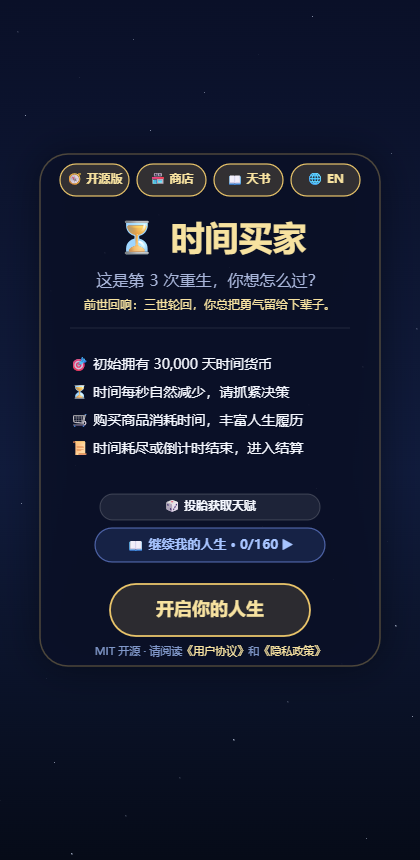
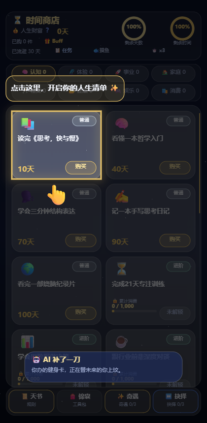
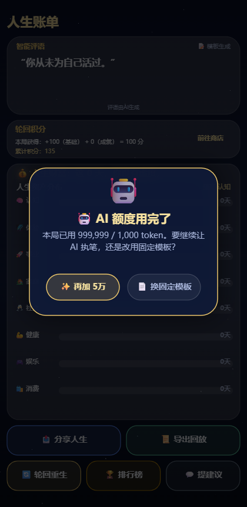
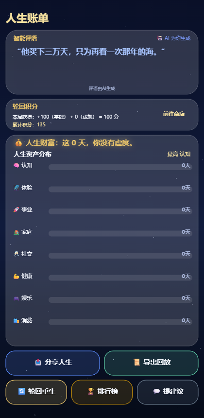

# ⏳ 时间买手 time-buyer

[English](./README.en.md) · 简体中文

> 我的时间，由我支配 —— 人生三万天
> Your lifespan is the currency.

**一个开源的人生模拟器**：出生给你 30000 天寿命，这就是你唯一的货币。买一段感情、一次旅行、一项技能，全都明码标价。15 分钟真实倒计时里过完一生，结算时你的"人生账单"会告诉你——你的钱（命）花在了哪里，值不值。

```bash
npm install && npm run dev
# 终端会打印一行地址（通常是 http://localhost:5173），复制进浏览器即可开玩
# 5 分钟后你就在买第 3 件东西了
```

**关了浏览器/电脑怎么再打开？** 回到项目目录重新跑 `npm run dev`，再访问终端打印的地址。跨局数据（成就、轮回积分、人生清单、语言、BYOK 配置）**存在浏览器 localStorage**，不会丢；但**进行中的一局不存盘**——关掉页面这 15 分钟的一生就结束了（下一世从欢迎页开始）。这是有意为之：一局 15 分钟的人生，中途退出本来也是一种"结局" 🙂 换浏览器或清过缓存则全局数据从零。不想每次开终端？`npm run build` 产出 `dist/` 目录，扔到任意静态托管（GitHub Pages 等）就是一个永久网址。

<p align="center">
  
  
  
  
</p>

## 玩法一览

- 🧠 **8 大人生分类 × 160 件商品**：认知/体验/事业/家庭/社交/健康/娱乐/消费，普通→传奇 4 档稀有度，逐步解锁。
- ⏱️ **双时钟压力**：寿命天数会自然流逝，现实 15 分钟也会归零——"花钱"和"活着"都在消耗生命。
- 🛤️ **3 次人生岔路**：消费 1500 / 8000 / 15000 天触发抉择，深耕优势还是弥补短板，直接改变整局折扣结构。
- 🎲 **10 种出身 Buff + 随机事件 + 奇遇剧情**：每局都是不同的人生开局。
- 🏅 **墓志铭结算**：4 层评语引擎（洞察/反思/反差/金句）+ 8 条隐藏彩蛋，根据你的消费结构给你"这一生"写一句话。
- 🔁 **轮回与人生清单**：每局结束获得轮回积分（RP），跨世收集 160 段人生——"有些习惯，死了都改不掉"。
- 📜 **人生回放导出**：结算页一键把这一生变成 Markdown 大事记（买什么、遇什么、怎么选），下载或复制到剪贴板就能晒。

## 这个项目在证明什么

同一套**纯 Canvas、零框架依赖**的游戏代码（ES Modules 原生编写），通过一个 `platform-web.js` 适配层，同时运行在：

| 平台 | 入口 | 状态 |
|---|---|---|
| 抖音小游戏 | `game.js`（官方 `tt.*` API） |  上线准备中 |
| 浏览器 | `src/web-main.js`（本 shim） | ✅ 现在就能玩 |

游戏代码里所有平台调用（云函数、广告、好友榜、分享）都设计了缺失兜底——在浏览器里它们自动降级为**离线模式**：本地模板评语、每日免费续命、PNG 下载分享。**没有平台兜底，游戏反而更完整。**

```
src/
├─ platform-web.js   # ← 唯一的"新代码"：浏览器 tt-shim（~190 行）
├─ logic.js / db.js / settlement.js / lifetime.js / state.js / ui.js
│                    # ← 抖音版原样复用（约 9,500 行）
```

## 路线图

- [x] v0.1 浏览器可玩（离线模式）
- [x] v0.2 **BYOK 接入你的 LLM**：OpenAI / Claude / Gemini / DeepSeek / Ollama 全兼容，墓志铭由你的模型为你写
- [x] v0.3 **里程碑 AI 对话 + 壳层双语（中/EN）**：三次人生岔路口，父亲/老友/镜中的先和你说话，再让你选
- [x] v0.4 **人生回放导出（Markdown）**：结算页一键导出"一生大事记"时间线，文件下载 + 剪贴板双通道
- [ ] v1.0 正式发布

> 备选池（不排期、不承诺，欢迎社区认领）：Seed 分享（可复现的一局）、Prompt Pack（内容本地化包）。

## 抉择前的三个人（v0.3）

人生有三次岔路口（消费 1500 / 8000 / 15000 天）。每次抉择之前，会有"人"先开口：

- **第一次 · 父亲** —— 话不多，句句落地。
- **第二次 · 老友** —— 插科打诨，但懂你。
- **第三次 · 镜中的自己** —— 冷静，不客气。

接入 BYOK 后，台词由你的模型结合**这一局的消费结构**现场生成（AI 请求失败/超时则静默使用本地固定台词——对话永远发生，AI 只是让它更懂你）。本地台词同样双语，跟随时切换的界面语言。

选完方向后，这个选择会被凝练成一句**人生信条**（无 BYOK 用确定性本地模板兜底，接入后由 AI 命名）——它会出现在你的人生回放里，也会被喂给墓志铭的 prompt：**AI 记得你说过什么**。

## 关于语言（中 / EN）

- 游戏**壳层双语**：按钮、弹窗、HUD、结算页框架、类目名、里程碑对话台词。首次打开按浏览器语言自动选择，之后随时可在首页顶栏「🌐 EN / 🌐 中文」一键切换（选择持久化到 localStorage）。
- 游戏**内容（160 件商品、随机事件、Buff、墓志铭模板）目前是中文**。原因：壳层是"界面"，翻译是纯工程；内容约 800 条，其中大量是中文互联网梗（如「996 的福报」），直译会杀死笑点——这部分更适合做成 **Prompt Pack / 社区贡献的本地化包**，而不是我来硬翻。英文区玩家接入自己的模型后，墓志铭和里程碑对话会跟随界面语言用英文生成。
- 想认领一个语言包？开 issue 说一声，仓库会为你留目录。

## 接入你的模型（BYOK）

结算墓志铭默认由本地 4 层评语引擎生成——**无 Key、零联网，这就是离线默认体验**。接入你自己的 LLM 后，"这一生"的那句话改由你的模型来写，此外 AI 还会：为每个岔路口的选择凝练一句**人生信条**（进回放、进墓志铭的 prompt）、把际遇/奇遇的旁白**按这局人生重新讲述**、在摸鱼时补一句扎心吐槽、在投胎时送来一句**前世回响**。**所有这些都有本地兜底，AI 只是锦上添花——游戏永远先能离线玩通。**

**入口**：游戏内右下角「🧭 开源版」→「🔑 接入模型（BYOK）」。

填三项即可，内置预设一键切换：

| 预设 | Base URL | 说明 |
|---|---|---|
| DeepSeek | `https://api.deepseek.com/v1` | 推荐，国内可达，支持 CORS（V4 系列默认开"深度思考"，本仓库已自动发送 `thinking:{type:"disabled"}` 关闭——否则思维链会吃光输出预算、返回 200 空正文） |
| Ollama | `http://localhost:11434/v1` | 完全本地，连 Key 都不用填 |
| OpenAI | `https://api.openai.com/v1` | 浏览器直连可能被 CORS 拦截，建议配反向代理或用 Ollama |
| 自定义 | 任意 OpenAI 兼容端点 | Claude / Gemini 经 one-api 等网关转换后均可 |

**四条承诺，写进代码而不是写进 README**：

1. **Key 只存在你浏览器的 localStorage**，没有中间服务器，没有任何遥测上报。
2. **请求直接从你的浏览器发到你的模型服务商**，本仓库不代理任何流量。
3. **失败静默降级**——超时 25 秒、HTTP 报错、无配置，都会自动回到本地评语引擎，游戏永不因 AI 卡死。
4. **额度由你设上限**——BYOK 面板可填 token 预算（跨局累计）。用完不静默、不催促：结算页弹出两个出口，"再加一点"或"换固定模板"，选择权在你。

想验证？AI 相关代码全部集中在 `src/llm.js`（约 600 行，含额度门与 BYOK 面板），欢迎审计。

## 关于广告

抖音版有激励视频广告（续命/刷新锦囊），这是小游戏的商业形态。**开源版一行广告代码都没有**——续命改为每日免费一次，锦囊刷新改为本局免费一次。冒烟测试里有一条专门的断言扫描全项目，出现任何 `createRewardedVideoAd` 字样直接报错。商业模式的痕迹也值得被测试钉死在地板上。

## 本地开发

```bash
npm install
npm run dev        # Vite 开发服务器
npm run build      # 产出 dist/（可托管 GitHub Pages）
npm test           # 冒烟测试（Node mock 抖音 API，无需浏览器）
```

## License

MIT —— 随便用，随便改，注明出处会更好。
